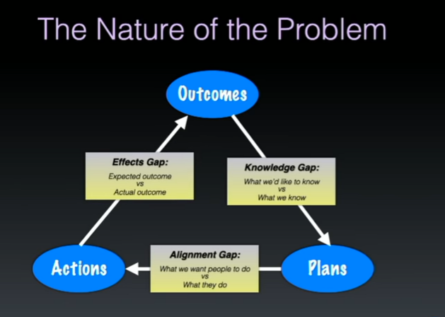
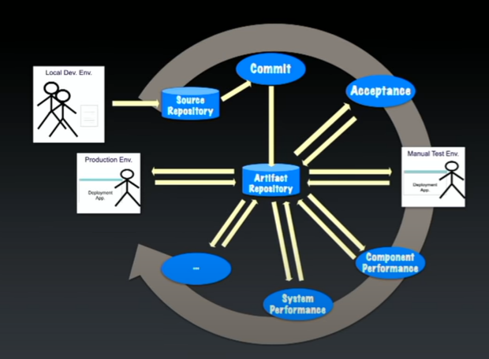
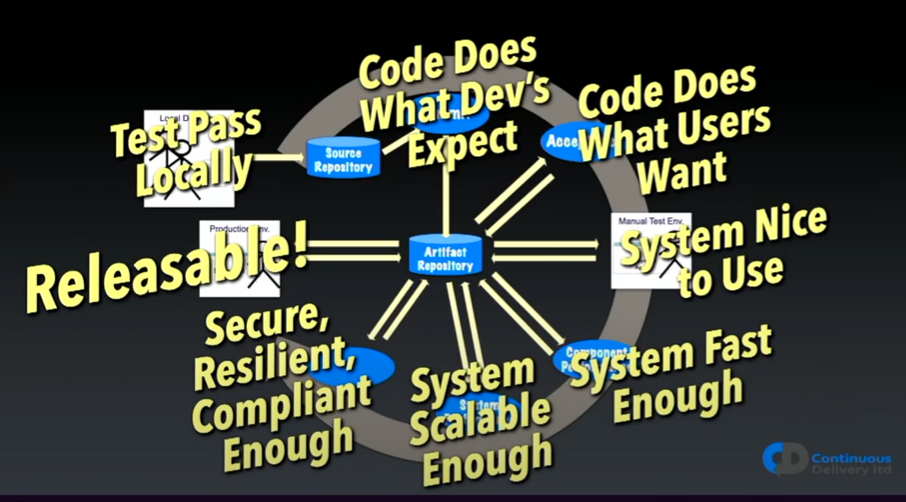

# Original talk
https://www.youtube.com/watch?v=MYVrLXKJp0Y

# What do you think of when hearing the term continuous delivery?
- Dave Farley's book
- State of Devops reports
    - Analyse the practices of Devops and how it impacts our work as devs.

**Interesting book** - Accelerate (the science of devops) Nicole Forsgren

`Throughput = lead time & frequency`

- Throughput = Speed = Efficiency
- Lead Time - time between commiting code and release in stable release
- Frequency = how often you deploy changes

`Stability = Change Failure Rate & Recovery Failure Time`

- Stability = Quality
- Change Failure Rate = How often are defects introduced to system?
- Recovery Time = How quickly can we fix it?

# There is no trade off between speed and quality

## Knowledge gap
- Normal method - plan harder and analyse more
- Makes you go slower

## Aligmnment Gap
- Process control
- Micromanage
- Makes you go slower

## Effects Gap
- Expectation management - under promised over deliver
- Watermelon status reporting

# Counterintuitive thought

> We need to develop quickly to get a quality product and a quality product for speed
- We need speed to get quality
    - We need faster feedback so we know what is wrong

- Quality for speed
    - We need quality code so we can iterate quickly (hint testing)

**Idea** Make smaller changes and and observe the impact

# What determines 'Releaseability'?

Idea - having a machine somewhere running Jenkins jobs doesn't mean you're doing Continuous Delivery.

Parts of a system which determine whether our software is releasable.

# Automated Testing
- One aspect of TDD will force you to try mock the system before you even code it up. 
- It will give you good feedback, if it's difficult to setup it sucks
- You can have pipelines running at different levels. 
    - You want to get the important tests first i.e. technical correctness
    - This allows you to iterate faster
    - If you want speed tests, run it in another pipeline

**Interesting Idea** 

To test SQL Injection issues. You can inject SQL into every input field and see if any of it gets through.

# Acceptance Test
- Looking at software as a external user
- Does it do what users actually want it to do?
- Evaluate software in lifelike scenarios
- Do testing in production-like testing environment
    - Deploy using the same tools into a test env
    - Mock user interactions 
    - (See Executable specifications)
- This is BDD
- The idea is that you can chuck out your entire code base, move to a new tech stack and these test will remain useful

# Smoke/Health Testing
- Push out the code,
- start up the "instance"
- pepper it with acceptance tests and get quick feedback on how it's doing.

# Testing time
- For commit testing aim for test results in under 5 minutes
- For acceptance testing. Aim for results in under an hour